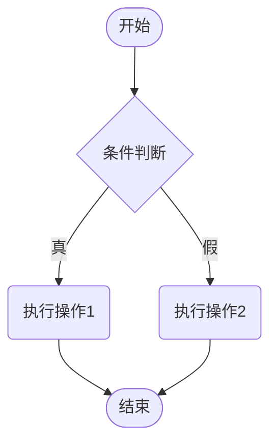
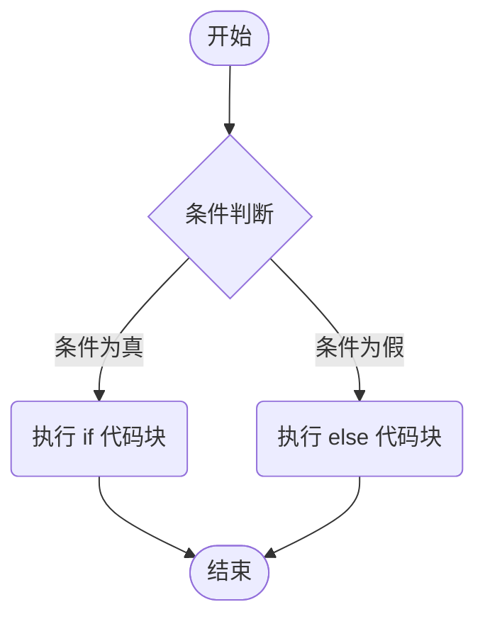
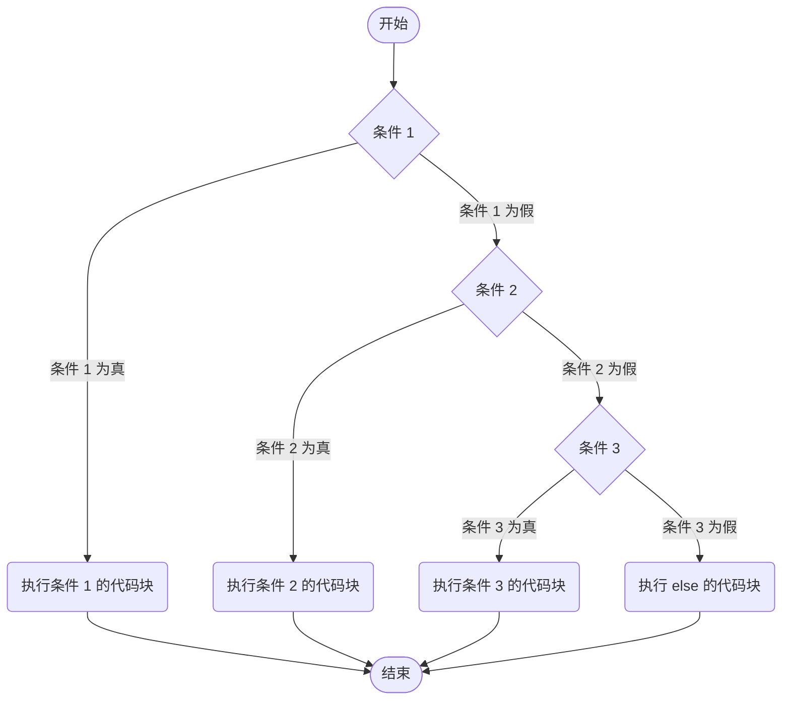
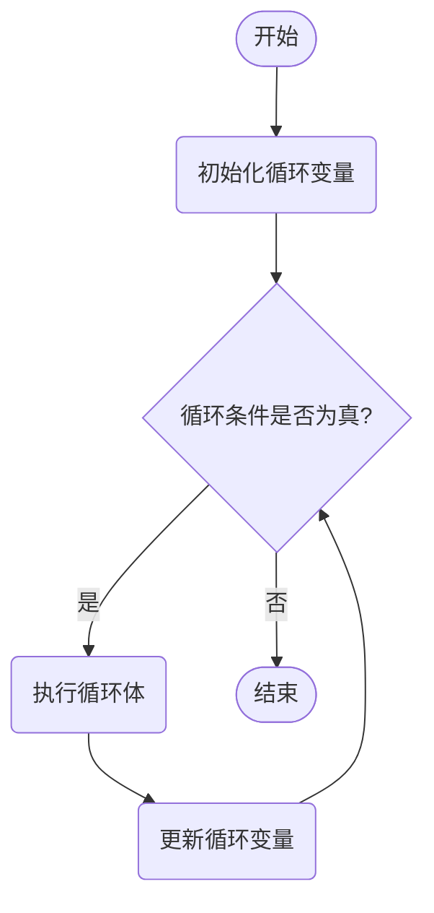
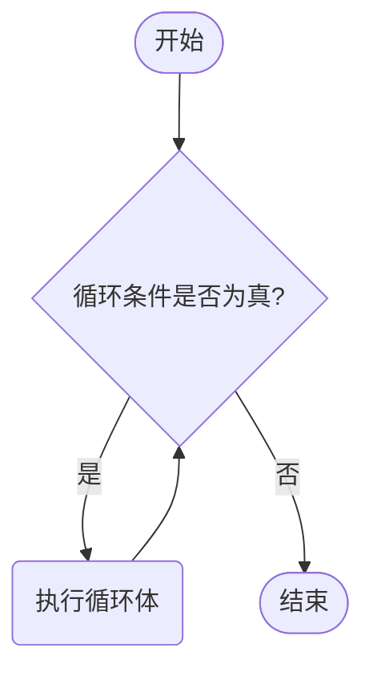
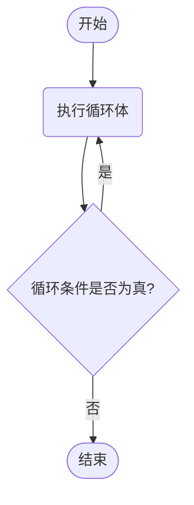

# 04 - 流程控制语句


## 第一章 流程控制语句

### 1.1 流程控制语句分类

​	顺序结构

​	判断和选择结构(if, switch)

​	循环结构(for, while, do…while)

## 第二章 判断语句：if语句

### 2.1 if语句格式1

```java
格式：
if (关系表达式) {
    语句体;	
}
```

执行流程：

①首先计算关系表达式的值

②如果关系表达式的值为true就执行语句体

③如果关系表达式的值为false就不执行语句体

④继续执行后面的语句内容



示例：

```java
public class IfDemo {
	public static void main(String[] args) {
		System.out.println("开始");	
		//定义两个变量
		int a = 10;
		int b = 20;	
		//需求：判断a和b的值是否相等，如果相等，就在控制台输出：a等于b
		if(a == b) {
			System.out.println("a等于b");
		}		
		//需求：判断a和c的值是否相等，如果相等，就在控制台输出：a等于c
		int c = 10;
		if(a == c) {
			System.out.println("a等于c");
		}		
		System.out.println("结束");
	}
}
```

#### 练习1：称体重

需求：

​	键盘录入体重,大于等于180斤,则输出“体重偏重”,否则没有任何回应。

代码示例：

```java
//分析：
// 键盘录入一个人的体重
Scanner sc = new Scanner(System.in);
System.out.println("请输入你的体重（斤）");
int weight = sc.nextInt(); // 假设输入175

// 对体重进行判断
if (weight >= 180) {
    System.out.println("体重偏重");
}ystem.out.println("不错哟，小伙子！");
}
```

#### 练习2：微信步数

需求：

​	键盘录入一个整数，表示小明的步数，如果步数大于等于10000步，则输出“小明完成了每日微信步数的目标”，否则输出"再接再励"

代码示例：

```java
// 分析：
// 1. 键盘录入一个整数，表示小明的步数
Scanner sc = new Scanner(System.in);
System.out.println("请输入小明的步数");
int steps = sc.nextInt();

// 2. 对小明的步数进行判断即可
if (steps >= 10000) {
    System.out.println("小明完成了每日微信步数的目标");
} else {
    System.out.println("再接再励");
}
```

#### 第一种格式的细节：

1. 如果我们要对一个布尔类型的变量进行判断，不要写==，直接把变量写在小括号中即可。

2. 如果 if 语句块中只有一条语句，可以省略大括号。
   省略大括号后，if 语句只控制其后紧跟的那一条语句。

   **建议：**不要在自己的代码中这样写，但如果遇到这样的代码，要能够理解其含义。

### 2.2 if语句格式2

```java
格式：
if (关系表达式) {
    语句体1;	
} else {
    语句体2;	
}
```

执行流程：

①首先计算关系表达式的值

②如果关系表达式的值为true就执行语句体1

③如果关系表达式的值为false就执行语句体2

④继续执行后面的语句内容



示例：

```java
public class IfDemo02 {
    public static void main(String[] args) {
        System.out.println("开始");        
        // 定义两个变量
        int x = 15;
        int y = 10;
        // 需求：判断x是否大于y，如果是，在控制台输出：x的值大于y，否则，在控制台输出：x的值不大于y
        if(x > y) {
            System.out.println("x的值大于y");
        } else {
            System.out.println("x的值不大于y");
        }        
        System.out.println("结束");
    }
}

```

#### 练习1：踢足球

需求：

	编写一个Java程序，模拟根据天气情况决定活动的行为。具体要求如下:

从键盘录入一个字符串，表示当前的天气情况（“下雨”或“不下雨”）。
​根据录入的天气情况做出相应的活动选择：
​如果天气是“下雨”，则输出“看电视”。
​如果天气是“不下雨”，则输出“踢足球”。

代码示例：

```java
// 分析：
// 1. 键盘录入一个字符串，表示天气情况。
Scanner sc = new Scanner(System.in);
System.out.println("请输入天气情况（下雨/不下雨）");
String weather = sc.next();

// 2. 对天气情况进行判断
if (weather.equals("下雨")) {
    System.out.println("看电视");
} else {
    System.out.println("踢足球");
}
```

#### 练习2：影院选座

需求：

​	在实际开发中，电影院选座也会使用到if判断。

​	假设某影院售卖了100张票，票的序号为1~100。

​	其中奇数票号坐左侧，偶数票号坐右侧。

​	键盘录入一个整数表示电影票的票号。

​	根据不同情况，给出不同的提示：

​		如果票号为奇数，那么打印坐左边。

​		如果票号为偶数，那么打印坐右边。

代码示例：

```java
//分析：
 //键盘录入
Scanner sc = new Scanner(System.in);
System.out.println("请输入您的号码:");
int Number = sc.nextInt();
//票号范围
if (Number >= 1 && Number <= 100) {
    //判断奇数和偶数
    if (Number % 2 == 0){
        System.out.println("坐右边");
    }else {
        System.out.println("坐左边");
    }
//票号不在范围的提示
}else {
    System.out.println("输入错误!请输入1~100的整数号码!");
}
```

### 2.3 if语句格式3

```java
格式：
if (关系表达式1) {
    语句体1;	
} else if (关系表达式2) {
    语句体2;	
} 
…
else {
    语句体n+1;
}
```

执行流程：

①首先计算关系表达式1的值

②如果值为true就执行语句体1；如果值为false就计算关系表达式2的值

③如果值为true就执行语句体2；如果值为false就计算关系表达式3的值

④…

⑤如果没有任何关系表达式为true，就执行语句体n+1。




#### 练习1：考试奖励

需求：

​	小明快要期末考试了，小明爸爸对他说，会根据他不同的考试成绩，送他不同的礼物，

假如你可以控制小明的得分，请用程序实现小明到底该获得什么样的礼物，并在控制台输出。

分析：

​	①小明的考试成绩未知，可以使用键盘录入的方式获取值

​	②由于奖励种类较多，属于多种判断，采用if...else...if格式实现

​	③为每种判断设置对应的条件

​	④为每种判断设置对应的奖励

代码示例：

```java
//95~100 自行车一辆
//90~94   游乐场玩一天
//80 ~ 89 变形金刚一个
//80 以下  胖揍一顿

//1.键盘录入一个值表示小明的分数
Scanner sc = new Scanner(System.in);
System.out.println("请输入小明的成绩");
int score = sc.nextInt();
//2.对分数的有效性进行判断
if(score >= 0 && score <= 100){
    //有效的分数
    //3.对小明的分数进行判断，不同情况执行不同的代码
    if(score >= 95 && score <= 100){
        System.out.println("送自行车一辆");
    }else if(score >= 90 && score <= 94){
        System.out.println("游乐场玩一天");
    }else if(score >= 80 && score <= 89){
        System.out.println("变形金刚一个");
    }else{
        System.out.println("胖揍一顿");
    }
}else{
    //无效的分数
    System.out.println("分数不合法");
}
```

## 第三章 switch语句

### 3.1 格式

```java
switch (表达式) {
	case 1:
		语句体1;
		break;
	case 2:
		语句体2;
		break;
	...
	default:
		语句体n+1;
		break;
}
```

### 3.2 **执行流程：**

- 先执行表达式的值，再拿着这个值去与case后的值进行匹配。
- 与哪个case后的值匹配为true就执行哪个case块的代码，遇到break就跳出switch分支。
- 如果全部case后的值与之匹配都是false，则执行default块的代码。

注意:

- case给出的值不允许重复，且只能是字面量，不能是变量。

- 正常使用switch的时候，不要忘记写break，否则会出现穿透现象。

  ```mermaid
  graph TD;
      A([开始]) --> B(计算 switch 表达式的值);
      B --> C{是否有匹配的 case?};
      C -- 是 --> D(执行匹配 case 的代码块);
      C -- 否 --> E{是否有 default?};
      D --> F{是否遇到 break?};
      F -- 是 --> J([结束]);
      F -- 否 --> G(继续执行下一个 case 的代码块);
      G --> F;
      E -- 是 --> H(执行 default 代码块);
      E -- 否 --> J;
      H --> J;
  ```
  
  

#### 练习：运动计划

- 需求：键盘录入星期数，显示今天的减肥活动。

  周一：跑步  

  周二：游泳  

  周三：慢走  

  周四：动感单车

  周五：拳击  

  周六：爬山  

  周日：好好吃一顿

- 代码示例：

```java
package SwitchLoop;

import java.util.Scanner;

public class SwitchDemo1 {
    public static void main(String[] args) {
    /*
    需求：键盘录入星期数，显示今天的减肥活动。
    星期一：跑步
    星期二：游泳
    星期三：慢走
    星期四：动感单车
    星期五：拳击
    星期六：爬山
    星期日：好好吃一顿
    */

    // 创建Scanner对象以读取用户输入
    Scanner sc = new Scanner(System.in);
    System.out.println("请输入星期一~星期日:");
    String week = sc.next();

    // 使用switch语句根据输入的星期数显示相应的减肥活动
    switch (week) {
        case "星期一":
            System.out.println("跑步");
            break;
        case "星期二":
            System.out.println("游泳");
            break;
        case "星期三":
            System.out.println("慢走");
            break;
        case "星期四":
            System.out.println("动感单车");
            break;
        case "星期五":
            System.out.println("拳击");
            break;
        case "星期六":
            System.out.println("爬山");
            break;
        case "星期日":
            System.out.println("好好吃一顿");
            break;
        default:
            System.out.println("输入错误!");
            break;
    }
  }
}
```

### 3.3 switch的扩展知识：

- default的位置和省略情况

  default可以放在任意位置，也可以省略

- case穿透

  不写break会引发case穿透现象

- switch在JDK12的新特性

```java
int number = 10;
switch (number) {
    case 1 -> System.out.println("一");
    case 2 -> System.out.println("二");
    case 3 -> System.out.println("三");
    default -> System.out.println("其他");
}
```

- switch和if第三种格式各自的使用场景

当我们需要对一个范围进行判断的时候，用if的第三种格式

当我们把有限个数据列举出来，选择其中一个执行的时候，用switch语句

比如：

​	小明的考试成绩，如果用switch，那么需要写100个case，太麻烦了，所以用if简单。

​	如果是星期，月份，客服电话中0~9的功能选择就可以用switch

#### 练习：休息日和工作日

需求：键盘录入星期数，输出工作日、休息日。

(1-5) 工作日，(6-7)休息日。

代码示例：

```java
//分析：
//1.键盘录入星期数
Scanner sc = new Scanner(System.in);
System.out.println("请输入星期");
int week = sc.nextInt();//3
//2.利用switch进行匹配
----------------------------------------------------
利用case穿透简化代码
switch (week){
    case 1:
    case 2:
    case 3:
    case 4:
    case 5:
        System.out.println("工作日");
        break;
    case 6:
    case 7:
        System.out.println("休息日");
        break;
    default:
        System.out.println("没有这个星期");
        break;
}
----------------------------------------------------
利用JDK12简化代码书写
switch (week) {
    case 1, 2, 3, 4, 5 -> System.out.println("工作日");
    case 6, 7 -> System.out.println("休息日");
    default -> System.out.println("没有这个星期");
}
```

## 第四章 循环结构

### 4.1 for循环结构（掌握）

​	循环语句可以在满足循环条件的情况下，反复执行某一段代码，这段被重复执行的代码被称为循环体语句，当反复 执行这个循环体时，需要在合适的时候把循环判断条件修改为false，从而结束循环，否则循环将一直执行下去，形成死循环。 

#### 4.1.1 for循环格式：

```java
for (初始化语句;条件判断语句;条件控制语句) {
	循环体语句;
}
```

**格式解释：**

- 初始化语句：  用于表示循环开启时的起始状态，简单说就是循环开始的时候什么样
- 条件判断语句：用于表示循环反复执行的条件，简单说就是判断循环是否能一直执行下去
- 循环体语句：  用于表示循环反复执行的内容，简单说就是循环反复执行的事情
- 条件控制语句：用于表示循环执行中每次变化的内容，简单说就是控制循环是否能执行下去

**执行流程：**

①执行初始化语句

②执行条件判断语句，看其结果是true还是false

​             如果是false，循环结束

​             如果是true，继续执行

③执行循环体语句

④执行条件控制语句

⑤回到②继续



**for循环书写技巧：**

- 确定循环的开始条件
- 确定循环的结束条件
- 确定循环要重复执行的代码

代码示例：

```java
//1.确定循环的开始条件
//2.确定循环的结束条件
//3.确定要重复执行的代码

//需求：打印5次HelloWorld
//开始条件：1
//结束条件：3
//重复代码：打印语句

for (int i = 1; i <= 3; i++) {
    System.out.println("HelloWorld");
}
```

1. 循环一开始，执行int i = 0 一次。
2. 此时  i=0 ，接着计算机执行循环条件语句：0 < 3返回true , 计算机就进到循环体中执行，输出 ：helloWorld ，然后执行迭代语句i++。
3. 此时  i=1 ，接着计算机执行循环条件语句：1 < 3返回true , 计算机就进到循环体中执行，输出 ：helloWorld ，然后执行迭代语句i++。
4. 此时  i=2 ，接着计算机执行循环条件语句：2 < 3返回true , 计算机就进到循环体中执行，输出 ：helloWorld ，然后执行迭代语句i++。
5. 此时  i=3 ，然后判断循环条件：3 < 3 返回false, 循环立即结束！！

##### for循环练习-输出数据

- 需求：在控制台输出1-5和5-1的数据 
- 示例代码：

```java
public class ForTest01 {
    public static void main(String[] args) {
		//需求：输出数据1-5
        for(int i=1; i<=5; i++) {
			System.out.println(i);
		}
		System.out.println("--------");
		//需求：输出数据5-1
		for(int i=5; i>=1; i--) {
			System.out.println(i);
		}
    }
}
```


##### for循环练习-求和

- 需求：求1-5之间的数据和，并把求和结果在控制台输出  
- 示例代码：

```java
public class ForTest02 {
    public static void main(String[] args) {
		//求和的最终结果必须保存起来，需要定义一个变量，用于保存求和的结果，初始值为0
		int sum = 0;
		//从1开始到5结束的数据，使用循环结构完成
		for(int i=1; i<=5; i++) {
			//将反复进行的事情写入循环结构内部
             // 此处反复进行的事情是将数据 i 加到用于保存最终求和的变量 sum 中
			sum = sum + i;
			/*
				sum += i;	sum = sum + i;
				第一次：sum = sum + i = 0 + 1 = 1;
				第二次：sum = sum + i = 1 + 2 = 3;
				第三次：sum = sum + i = 3 + 3 = 6;
				第四次：sum = sum + i = 6 + 4 = 10;
				第五次：sum = sum + i = 10 + 5 = 15;
			*/
		}
		//当循环执行完毕时，将最终数据打印出来
		System.out.println("1-5之间的数据和是：" + sum);
    }
}
```

- 本题要点：
  - 遇到的需求中，如果带有求和二字，请立即联想到求和变量
  - 求和变量的定义位置，必须在循环外部，如果在循环内部则计算出的数据将是错误的

##### for循环练习-求偶数和

- 需求：}
- 示例代码：

```java
public class ForTest03 {
    public static void main(String[] args) {
		//求和的最终结果必须保存起来，需要定义一个变量，用于保存求和的结果，初始值为0
		int sum = 0;
		//对1-100的数据求和与1-5的数据求和几乎完全一样，仅仅是结束条件不同
		for(int i=1; i<=100; i++) {
			//对1-100的偶数求和，需要对求和操作添加限制条件，判断是否是偶数
			if(i%2 == 0) {
                //sum += i；
				sum = sum + i;
			}
		}
		//当循环执行完毕时，将最终数据打印出来
		System.out.println("1-100之间的偶数和是：" + sum);
    }
}
```

##### for循环练习-统计次数

需求：

​	  键盘录入两个数字，表示一个范围。

​           统计这个范围中。

​           既能被3整除，又能被5整除数字有多少个？

代码示例：

```java
package ForLoops;

import java.util.Scanner;

public class ForDemo5 {
    public static void main(String[] args) { 
        // 创建Scanner对象，用于从键盘输入获取数据
        Scanner sc = new Scanner(System.in);
        
        // 提示用户输入最小范围值，并接收输入
        System.out.println("请输入最小范围:");
        int mini = sc.nextInt();
        // 提示用户输入最大范围值，并接收输入
        System.out.println("请输入最大范围:");
        int max = sc.nextInt();

        // 初始化计数器，用于统计满足条件的数字数量
        int count = 0;
        // 使用for循环遍历从最小范围到最大范围的所有数字
        for (; mini <= max; mini++) {
            // 检查当前数字是否同时被3和5整除，如果是，则计数器加一
            if (mini % 3 == 0 && mini % 5 == 0) {
                count++;
            }
        }
        // 输出范围内满足条件的数字总数
        System.out.println(mini + "~" + max + "范围内能被3和5同时整除数字" + count + "个");
    }
}

```

### 4.2 while循环

#### 4.2.1 格式：

```java
初始化语句;
while(条件判断语句){
	循环体;
	条件控制语句;
}
```




##### 练习1：打印5次HelloWorld

```java
int i = 1;
while(i <= 5){
    System.out.println("HelloWorld");
    i++;
}
System.out.println(i);
```

##### 练习2：珠穆朗玛峰

假设一张标准的A4纸厚度约为0.1毫米。每次将纸对折后，其厚度会翻倍。珠穆朗玛峰的高度约为8848米。
        问题:
        计算纸张对折多少次后，其厚度能够超过珠穆朗玛峰的高度？
        输出每次对折后的纸张厚度，直到超过珠穆朗玛峰的高度为止。

代码示例：

```java
//纸的厚度
double PaperHight = 0.1;
//珠穆朗玛峰的高度
double MountainHight = 8848.0;

//累计对折次数
double accumulate = 0;
//当纸的厚度小于等于珠穆朗玛峰的高度时，继续对折
while (PaperHight <= MountainHight) {

    //每次对折后，纸的厚度翻倍
    PaperHight = PaperHight * 2;
    //对折次数累计
    accumulate++;
}
//输出对折次数和最终纸的厚度
System.out.println("计算纸张对折" + accumulate + "次后，其厚度能够超过珠穆朗玛峰的高度" + "高度为:" + PaperHight);
```

### 4.3 do...while循环

本知识点了解即可

格式：

```java
初始化语句;
do{
    循环体;
    条件控制语句;
}while(条件判断语句);
```

特点：

​	先执行，再判断。




### 4.4 三种格式的区别：

​	for和while循环，是先判断，再执行。

​	do...while是先执行，再判断。

​	当知道循环次数或者循环范围的时候，用for循环。

​	当不知道循环次数，也不知道循环范围，但是知道循环的结束条件时，用while循环。